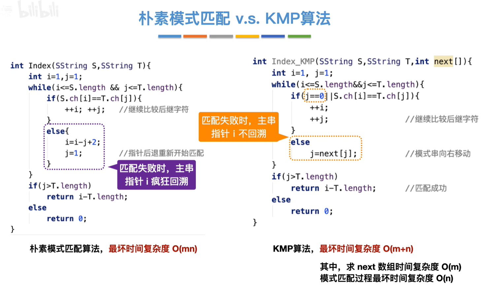

# 线性表
## 线性表的定义和特点（p18）
### 定义
$26个英文字母的字母表：(A,B,C,\cdots,Z)$

诸如此类有n个数据特性相同的元素构成的有限序列，称为线性表。

线性表中元素的个数n定义为线性表的长度，当n=0时称之为空表。

对于非空的线性表或线性结构，其特点是：
1. 存在唯一的一个被称作“第一个”的数据元素；
2. 存在唯一的一个被称作“最后一个”的数据元素；
3. 除第一个元素之外，结构中的每个数据元素均只有一个前驱；
4. 除了最后一个元素之外，结构中的每个数据元素均只有一个后继。

## 线性表的顺序表示（p22）
线性表的创建可以用malloc申请内存空间，用free释放内存空间。

### 顺序表
1. 快速访问：能在O(1)时间内找到第i个元素
2. 存储密度高：只存放元素，不需要存放其他的指针
3. 拓展容量不方便：静态分配不能拓展，动态分配拓展麻烦
4. 插入、删除元素不方便：插入、删除元素需要移动其他元素

### 链表
:::tip 判断为空
头节点的next指向NULL
:::
#### 循环单链表
如果需要频繁对链表的头部或尾部进行操作，可以让指针L指向表尾。需要注意的是，每次操作，都要重新更新指针L的位置。

:::tip 判断为空
头节点的next指向头节点（自己）
:::

:::tip 与单链表的区别
单链表：从一个节点出发只能找到后续的各个节点。

循环单链表：从一个结点出发可以找到其他任何一个节点。
:::

#### 循环双链表
:::tip 判断为空
头节点的next指向头节点（自己）
:::

#### 顺序表和链表的区别
相同点：
1. 都属于线性表，都是线性结构

顺序表：

优点：支持随机存取，存储密度高

缺点：大片连续空间分配不方便，改变容量不方便

链表：

优点：离散的小空间分配方便，改变容量方便

缺点：不可随机存取，存储密度低

## 字符串
### 模式匹配
:::tip 定义
在主串中找到与模式串相同的字串，并返回其所在位置。
:::

#### 朴素模式
主串长度为n，模式串长度为m，将主串中所有长度为m的字串依次与模式串对比，直到找到一个完全匹配的字串，或所有的子串都不匹配为止（共有n-m+1个字串）。

$时间复杂度：O(nm)$

#### KMP
分析模式串从哪个位置开始不匹配，然后跳转到已知的已经匹配的位置重新匹配。

$时间复杂度：O(n+m)$

