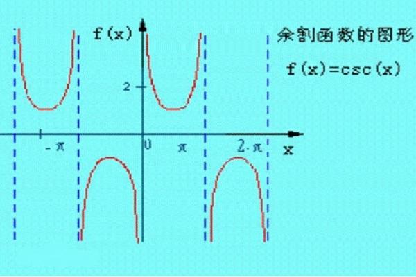
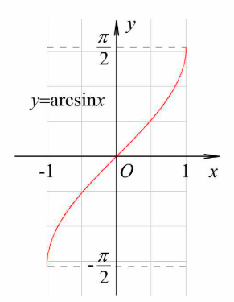
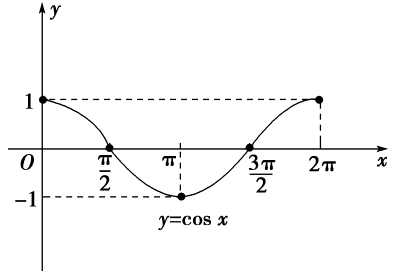
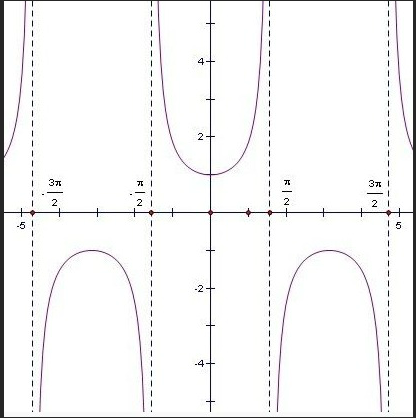
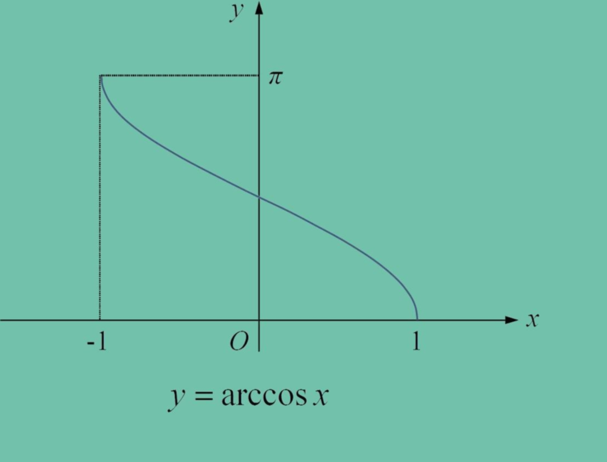
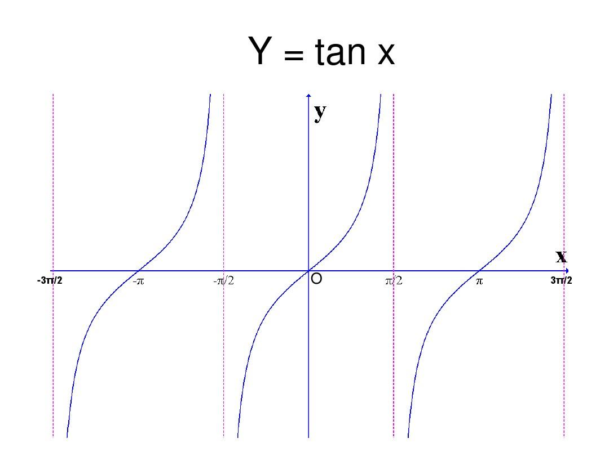
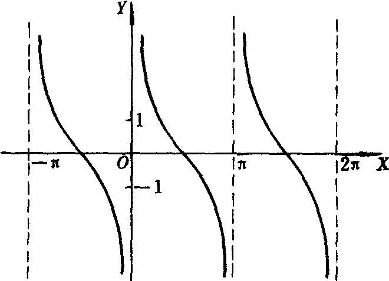
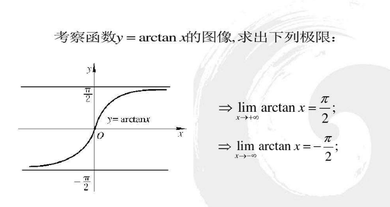

# 三角函数

## sin-csc-arcsin

### sin（奇）
:::info 正弦函数（对边比斜边）
$表达式：f(x)=A\sin(\omega x+\varphi)$

$周期：T=\frac{2\pi}{|\omega|}，最小正周期为2\pi$

$定义域：[-\infty,+\infty]，值域：[-1,1]$

$求导：(\sin x)'=\cos x$

:::

### csc（奇）
:::info 余割函数（斜边比对边）
$正弦函数的倒数，\csc=\frac{1}{\sin}$

$最小正周期为2\pi$

$定义域：x\neq k\pi，值域：y\geqslant 1或y\leqslant -1$

$求导：(\csc x)'=(\frac{1}{\sin x})'=\frac{-\cos x}{\sin^2x}=-\frac{1}{\sin x}\cdot\frac{\cos x}{\sin x}=-\csc x\cdot\cot x$

:::

### arcsin
:::info 反正弦函数
$正弦函数的反函数，y=a\sin\theta，则\theta=\arcsin\frac{y}{a}$

$定义域：[-1, 1]，值域：[-\frac{\pi}{2},\frac{\pi}{2}]$

$求导：(\arcsin x)'=\frac{1}{\sqrt{1-x^2}}$

:::

## cos-sec-arccos

### cos（偶）
:::info 余弦函数（邻边比斜边）
$表达式：f(x)=A\cos(\omega x+\varphi)$

$周期：T=\frac{2\pi}{|\omega|}，最小正周期为2\pi$

$定义域：[-\infty,+\infty]，值域：[-1,1]$

$求导：(\cos x)'=-\sin x$

:::

### sec（偶）
:::info 正割函数（斜边比邻边）
$余弦函数的倒数，\sec=\frac{1}{\cos}$

$最小正周期为2\pi$

$定义域：x\neq k\pi+\frac{\pi}{2}，值域：y\geqslant 1或y\leqslant -1$

$求导：(\sec x)'=(\frac{1}{\cos x})'=\frac{\sin x}{\cos^2x}=\frac{1}{\cos x}\cdot\frac{\sin x}{\cos x}=\sec x\cdot\tan x$

:::

### arccos
:::info 反余弦函数
$余弦函数的反函数，y=a\cos\theta，则\theta=\arccos\frac{y}{a}$

$定义域：[-1, 1]，值域：[0,\pi]$

$求导：(\arccos x)'=-\frac{1}{\sqrt{1-x^2}}$

:::

## tan-cot-arctan

### tan（奇）
:::info 正切函数（对边比邻边）
$表达式：f(x)=A\tan(\omega x+\varphi)$

$周期：T=\frac{\pi}{|\omega|}，最小正周期为\pi$

$定义域：x\neq\frac{\pi}{2}+k\pi，值域：[-\infty,\infty]$

$求导：(\tan x)'=(\frac{\sin x}{\cos x})'=\frac{\cos^2x+\sin^2x}{\cos^2x}=\frac{1}{\cos^2x}=\sec^2x$

:::

### cot（奇）
:::info 余切函数（邻边比对边）
$正切函数的倒数，\cot=\frac{1}{\tan}$

$最小正周期为\pi$

$定义域：x\neq k\pi，值域：[-\infty,\infty]$

$求导：(\cot x)'=(\frac{1}{\tan x})'=(\frac{\cos x}{\sin x})'=\frac{-\sin^2x-\cos^2x}{\sin^2x}=-\frac{1}{\sin^2x}=-\csc^2x$

:::

### arctan（奇）
:::info 反正切函数
$正切函数的反函数，y=a\tan\theta，则\theta=\arctan\frac{y}{a}$

$定义域：[-\infty, \infty]，值域：[-\frac{\pi}{2},\frac{\pi}{2}]$

$求导：(\arctan x)'=\frac{1}{1+x^2}$

:::

## 三角转换

### 倒数关系
$\sin x\cdot\csc x=1$

$\cos x\cdot\sec x=1$

$\tan x\cdot\cot x=1$

### 商数关系
$\tan x=\frac{\sin x}{\cos x}$

$\cot x=\frac{\cos x}{\sin x}$

### 平方关系
$\sin^2x+\cos^2x=1\qquad(1)$

$对(1)式两边同时除以\cos^2x，得\tan^2x+1=\sec^2x$

$对(1)式两边同时除以\sin^2x，得1+\cot^2x=\csc^2x$

### 和角公式与差角公式
$\sin(a+b)=\sin a\cdot\cos b+\cos a\cdot\sin b$

$\sin(a-b)=\sin a\cdot\cos b-\cos a\cdot\sin b$

$\cos(a+b)=\cos a\cdot\cos b-\sin a\cdot\sin b$

$\cos(a-b)=\cos a\cdot\cos b+\sin a\cdot\sin b$

$\tan(a+b)=\frac{\tan a+\tan b}{1-\tan a\cdot\tan b}$

$\tan(a-b)=\frac{\tan a-\tan b}{1+\tan a\cdot\tan b}$

### 二倍角公式
:::tip 
可通过和角公式与差角公式推出
:::
$\sin2a=2\sin a\cdot\cos a$

$\cos2a=\cos^2a-\sin^2a=2\cos^2a-1=1-2\sin^2a$

$\tan2a=\frac{2\tan a}{1-\tan^2a}$

### 半角公式
:::tip
可通过二倍角公式推出
:::
$(\sin\frac{a}{2})^2=\frac{1-\cos a}{2}$

$(\cos\frac{a}{2})^2=\frac{1+\cos a}{2}$

### 和差化积公式
$\sin a+\sin b=2\sin\frac{a+b}{2}\cos\frac{a-b}{2}$

$\sin a-\sin b=2\cos\frac{a+b}{2}\sin\frac{a-b}{2}$

$\cos a+\cos b=2\cos\frac{a+b}{2}\cos\frac{a-b}{2}$

$\cos a-\cos b=-2\sin\frac{a+b}{2}\sin\frac{a-b}{2}$

### 积化和差公式
$\sin a\cos b=\frac{1}{2}[\sin(a+b)+\sin(a-b)]$

$\cos a\sin b=\frac{1}{2}[\sin(a+b)-\sin(a-b)]$

$\cos a\cos b=\frac{1}{2}[\cos(a+b)+\cos(a-b)]$

$\sin a\sin b=-\frac{1}{2}[\cos(a+b)-\cos(a-b)]$

