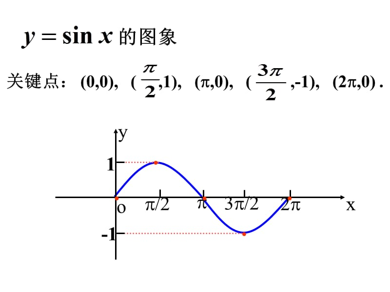

# 三角函数

## sin-csc-arcsin
:::info sin正弦函数（对边比斜边）
$表达式：f(x)=Asin(\omega x+\varphi)$

$周期：T=\frac{2\pi}{\omega}，最小正周期为2\pi$

$定义域：[-\infty, +\infty]，值域：[-1,1]$

图像：

:::

:::info csc余割函数（csc=1/sin）
$最小正周期为2\pi$

$定义域：x\neq k\pi，值域：y\geqslant 1或y\leqslant -1$
:::

## cos-sec-arccos

## tan-cot-arctan